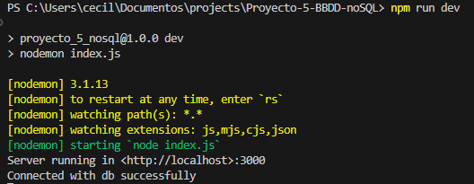
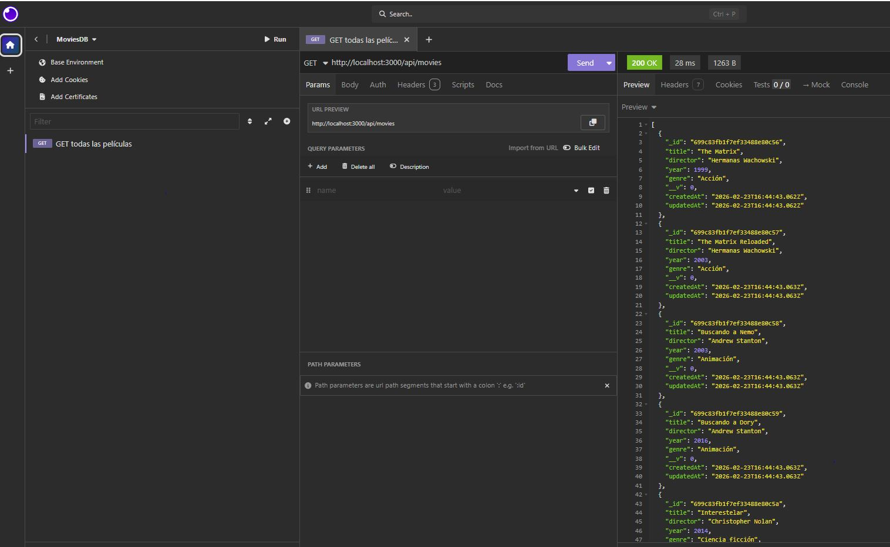
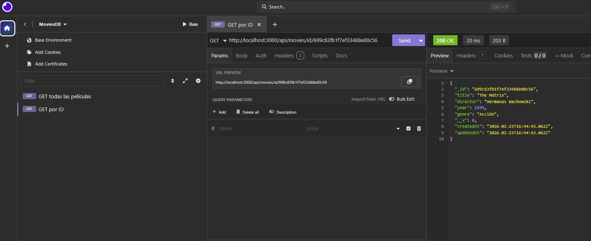
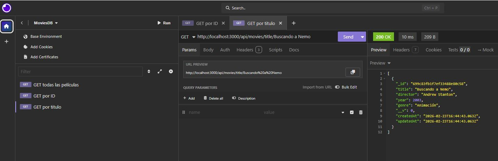
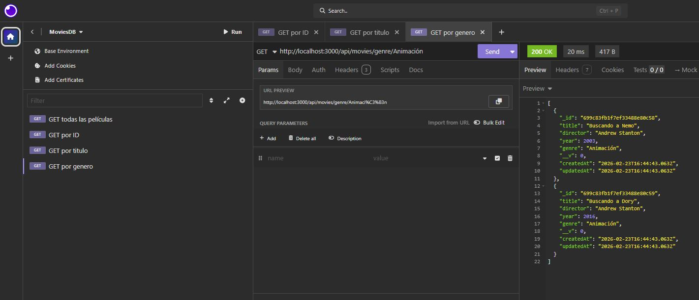
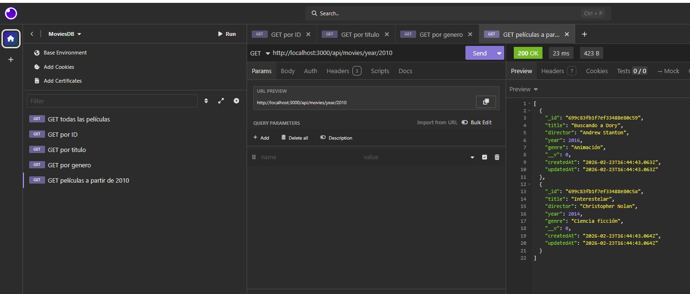
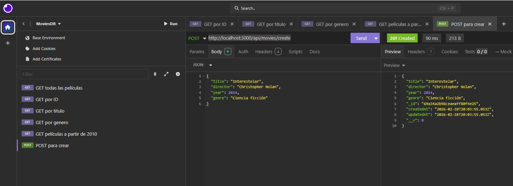
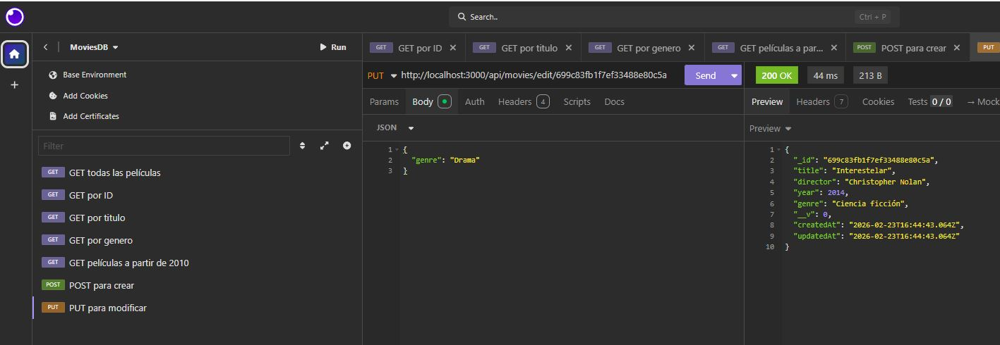
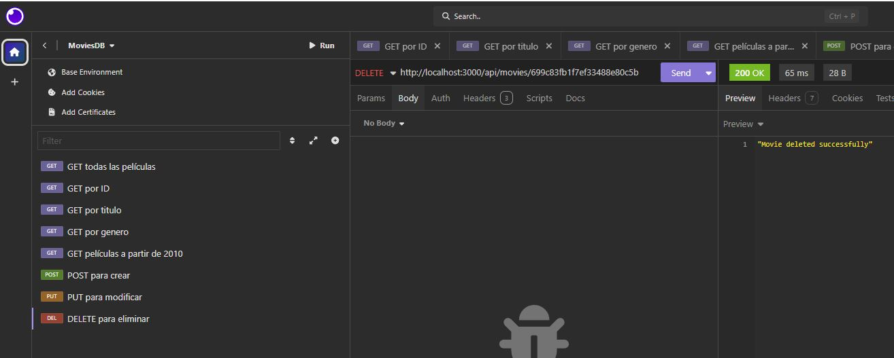

# Movies Server API

API REST para gestionar películas, construida con **Express.js** y **MongoDB (Mongoose)**.

---

## Tecnologías utilizadas

- Node.js
- Express.js
- MongoDB
- Mongoose
- Nodemon (desarrollo)

---

## Capturas de Postman / Insomnia

Adjunta imágenes de:

### 1. Arranque del servidor

### 2. GET todas las películas

### 3. GET por ID

### 4. GET por título

### 5. GET por género

### 6. GET películas a partir de 2010

### 7. POST para crear

### 8. PUT para modificar

### 9. DELETE para eliminar

